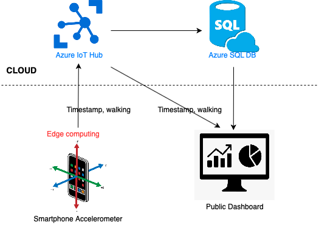

# Retrieve data from the smartphone accelerometer, to detect whether the user is walking or not

This is the foìlder for the 4th assignment for my IoT class at Sapienza university. In this assignment I had to build a mobile application that provides crowd-sensing. 

## Croud sensing application
It is an HTML5 application using the Generic Sensor API that collects data form the accelerator sensor of the smartphone. The values collected are sent to azure IoT Hub.

## Cloud based deployment

Given the data arriving to the cloud, it executes a model and provides a status for the state of the user either every 10 seconds.
The cloud based architecture is contained in the  folder.

## Edge based deployment

The activity recognition model is executed directly by the smartphone. Given the data collected by the smartphone, it provides a status for the state of the user.
The edge based architecture is contained in the  folder.

## Public Dashboard
It is a public dasboard that can display the result of the activity recognition model for both the cloud and edge based architectures. It is contained in the  folder.

## DB Handler
It is a python script I have used to create and delete tables from the DB. It is contained in the  folder.
